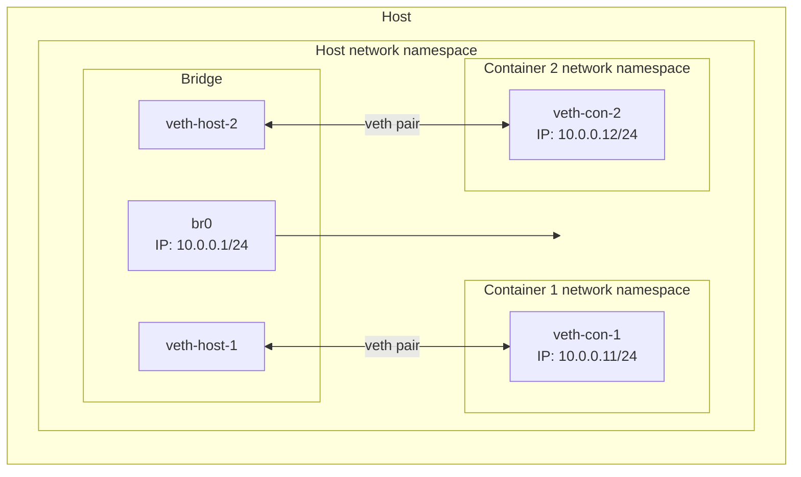

# Bridge network setup



This example creates two Linux network namespaces (`container1` and `container2`) and a veth pair. The veth pair is attached to the bridge which enables traffic to be routed between them.

## Test connectivity

```bash
vagrant ssh
sudo ip netns exec container1 ping -c 4 10.0.0.12
```

Inside the `container1` namespace attempt to `ping` the `container2` namespace