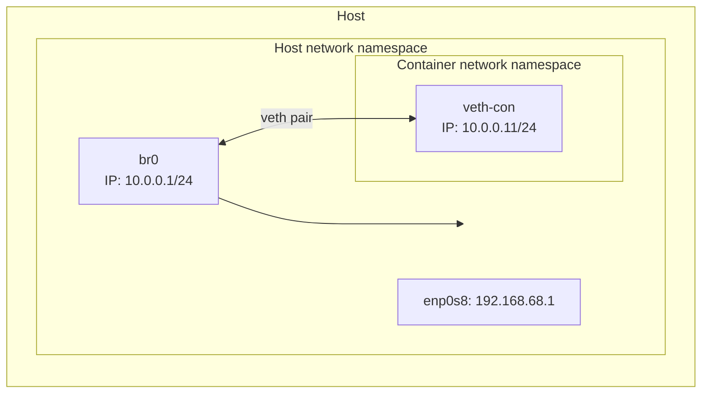

# Linux routing example



IP forwarding enables Linux to forward packets. Since the destination IP address is on the host the destination MAC address is set to the bridge (`46:84:35:92:77:db`). Layer 2 traffic is sent from the namespace through the bridge using the default route `10.0.0.1` which is then forwarded to the `enp0s8` interface.

## Test connectivity

```bash
vagrant ssh
sudo ip netns exec container ip route
sudo ip netns exec container ping -c 4 192.168.68.1
```

Inside the `container` namespace, attempt to `ping` the `enp0s8` interface on `192.168.68.1`.