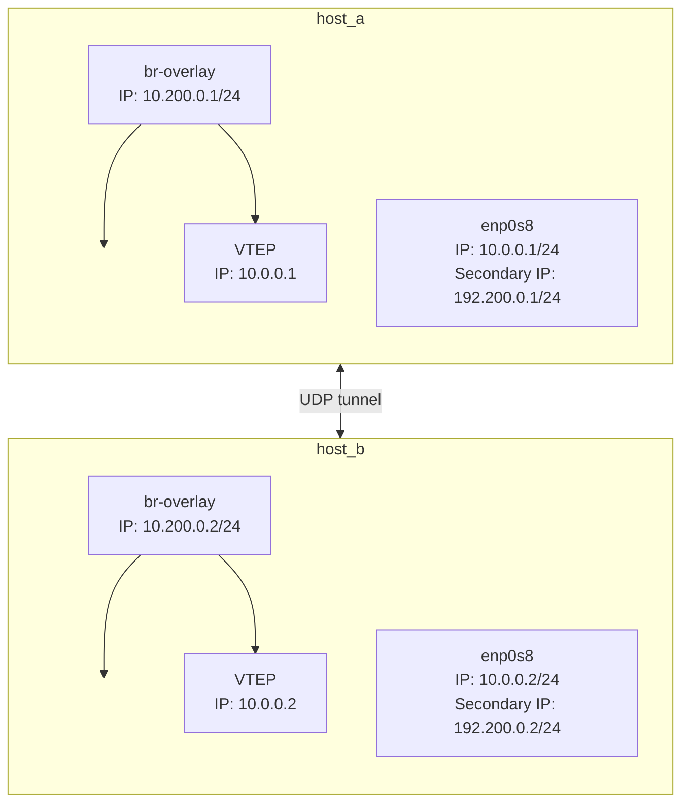

# Multiple IP addresses VXLAN setup



Bridges on both `host_a` and `host_b` are on an overlay network (`10.200.0.0/24`). Here `enp0s8` has a secondary IP address which is used for the underlay network for the VTEPs. VTEP encapsulates the Layer 2 packets and sends it from `enp0s8`.

## Test connectivity

```bash
vagrant ssh host_a
ping -c 4 10.200.0.2
```

Inside `host_a` attempt to `ping` the bridge on `host_b`.