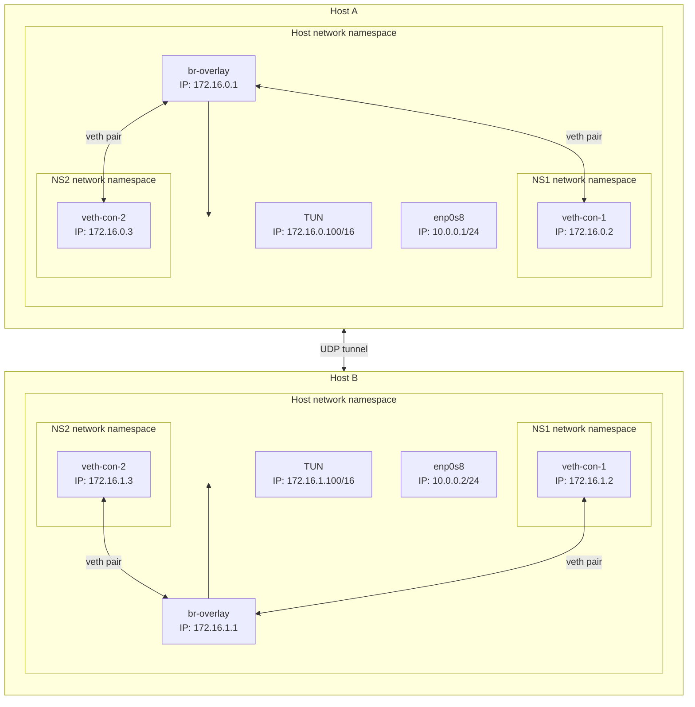

# Overlay network with TUN interfaces



Bridges and TUN on both `host_a` and `host_b` are on an overlay network (`172.16.1.100/16`). The underlay network for `enp0s8` are on a underlay network (`10.0.0.0/24`). `socat` then encapsulates packets that arrive on `TUN` into a UDP packet and sends it out of `enp0s8`.

## Setup UDP tunnels

Run the following on Host 1:

1. Setup the UDP tunnel on `host_a`

```
vagrant ssh host_a
sudo socat UDP:10.0.0.2:9000,bind=10.0.0.1:9000 TUN:172.16.0.100/16,tun-name=tundudp,iff-no-pi,tun-type=tun &
ip tuntap
```

2. Setup the UDP tunnel on `host_b`

```
vagrant ssh host_b
sudo socat UDP:10.0.0.1:9000,bind=10.0.0.2:9000 TUN:172.16.1.100/16,tun-name=tundudp,iff-no-pi,tun-type=tun &
ip tuntap
```

3. Turn on TUN device on `host_a`

```
vagrant ssh host_a
sudo ip link set dev tundudp up
```

4. Turn on TUN device on `host_b`

```
vagrant ssh host_b
sudo ip link set dev tundudp up
```

## Test connectivity

```
vagrant ssh host_a
sudo ip netns exec NS1 ping -c 4 10.0.0.2
```

Inside `host_a` attempt to `ping` the node IP on `host_b`.

```
vagrant ssh host_a
sudo ip netns exec NS1 ping -c 4 172.16.1.2
```

Inside `host_a` attempt to `ping` the IP in a namespace on `host_b`.