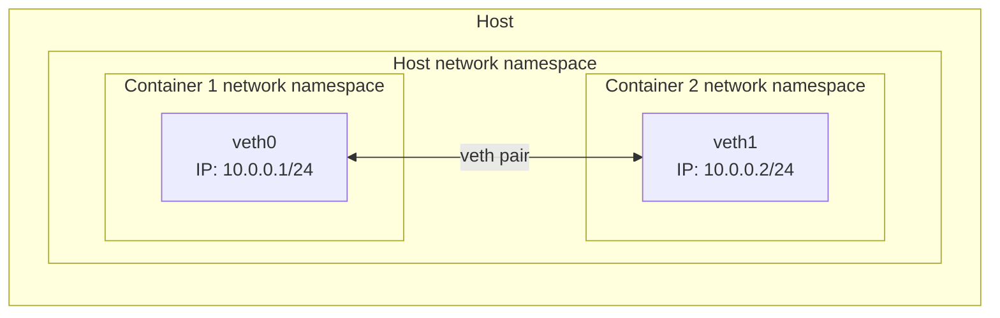

# Veth pair setup



This example creates two Linux network namespaces (`container1` and `container2`) and connects them with a single veth pair:
- `container1` interface: `veth0` with IP `10.0.0.1/24`
- `container2` interface: `veth1` with IP `10.0.0.2/24`

## Test connectivity

```bash
vagrant ssh
sudo ip netns exec container1 ping -c 4 10.0.0.2
```

Inside the `container1` namespace attempt to `ping` the `container2` namespace